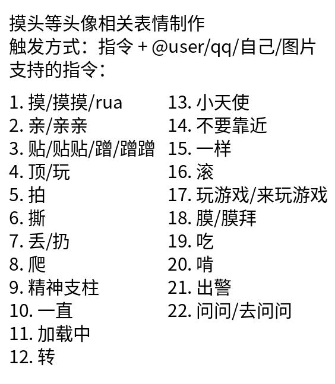

# 功能总览
这里是色图姬功能的介绍总览(不包括内测功能)

* 来点色图
* 来点妹子
* 来点本子
* 人工智障功能：(见详细说明)
* 自定义表情包功能：(见详细说明)
* 群友互动表情包功能：(见详细说明)
* 签到
* 运势
* 每日词云
* 查成分+B站UID（无空格）
* 早安晚安功能：(见详细说明)
* 设置撤回关键字：(见详细说明)
* 设置禁言关键字:(见详细说明)
* 骰娘功能：(见详细说明)
* 摸鱼人日历：(见详细说明)
* 牛子系统

## 来点色图

色图功能支持多份+tag搜索。命令格式：来x份y色图。x可替换为数字。y可替换成为关键字。

举例：来3份萝莉色图 此时机器人就会搜索包含萝莉关键字的色图。

同时支持多重tag，例如：来4份萝莉 魅魔色图。tag中间使用空格隔开，此时姬器人会搜索包含萝莉与魅魔关键字的色图。

### 特殊功能解锁：

色图默认具有CD、r18为关闭状态、图片质量为中等。若想解锁无CD色图、r18色图、原图。请联系维护组群主(为额外付费功能)。

## 人工智障功能
机器人可以进行学习对话功能。

命令格式为：学习对话 x y。x y可自由替换成任何关键字

当你输入x时，机器人会自动回复y (此学习对话没有任何权限设置，任何人都可以给机器人学习新的对话）

删除对话功能：

命令格式为：删除对话 x 这样以x为触发口令的y就不会被触发。（同样，任何人都能删除对话）

## 自定义表情包功能

## 群友互动表情包功能
触发指令需要在前面+/

例如：/转 @xxxx

## 早晚安功能：

发送早安、晚安关键词会自动统计群聊早安、晚安排名。并计算出每日工作时间与睡眠时间。

早安关键词：
['早', '早安', '哦哈哟', 'ohayo', 'ohayou', '早安啊', '早啊', '早上好']
晚安关键词：
['晚', '晚安', '哦呀斯密', 'oyasumi', 'oyasimi', '睡了', '睡觉了']

## 设置撤回关键字功能：

设置撤回关键字 xxx ；xxx可以替换为你想要撤回的内容。

姬器人在拥有管理权限之后，会自动检测关键字并撤回。例如设置了关键字：test 那么一切包含test的语句都会被姬器人撤回。

删除撤回关键字 xxx ；xxx为设置的撤回关键字

## 设置禁言关键字功能：

设置禁言关键字 xxx ；xxx可以替换为你想要禁言的内容。

姬器人在拥有管理权限之后，会自动检测关键字并禁言(60个小时)。例如设置了关键字：test 那么一切包含test的语句都会被姬器人禁言。

删除经验关键字 xxx ；xxx为设置的禁言关键字

## 骰娘功能：
目前只有一个扔骰子功能；

口令： .rXdY

用来表示扔X个Y面骰子，.r1d6为扔一次6面骰.

## 
牛子系统：

恶趣味玩法；关键词如下：

* 注册牛子: 注册属于你自己的牛子
* 牛子信息：查看自己的牛子信息
* 看他牛子@XXX: 查看XXX的牛子信息
* 互动关键字: pk,‘🔒’, ‘suo’, ‘嗦’, ‘锁’ ,打胶; 以上关键字都可以使用格式：关键字 @XXX来触发
* 牛子修炼：每日20：00-24：00可以使用牛子修炼功能，修炼可以获得大量长度
* 关注牛子/取关牛子 @XXX： 关注别人的牛子。关注了别人的牛子之后，使用互动关键字会有关注牛子的加成与帮助。
* 朋友费系统：关注了别人牛子之后，获得长度时会收取一定的朋友费
